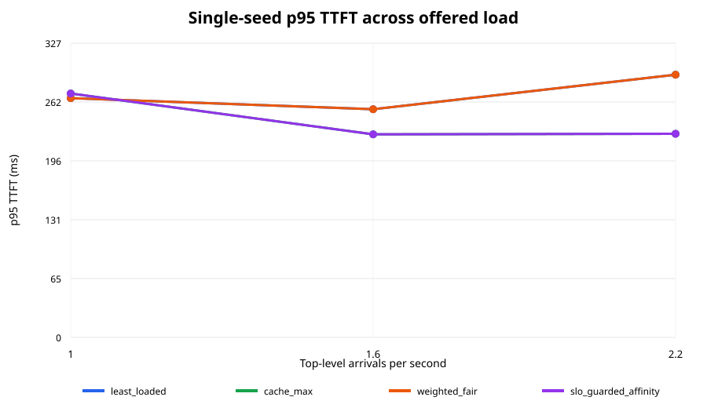

# LLMSchedBench

LLMSchedBench is a reproducible benchmark for evaluating request-routing and
admission policies across shared chat, coding-agent, and API/batch LLM
workloads.

The benchmark combines production-derived arrival and cache-reuse traces with
LLMServingSim execution modeling. Scheduling policy state and decisions live in
a small C++20 library exposed to Python through pybind11; Python owns data
normalization, experiment orchestration, metrics, and reporting.

## Status

The reproducible environment and first three bounded implementation milestones
are operational. Both public sources are checksummed and normalized, the pinned
simulator backend builds and reproduces its chat and agentic examples, and all
four C++ policies run through the tested CUSTOM-routing bridge. The completed
`overnight-m3` milestone contains 28 immutable simulator runs: a three-load,
four-policy matrix at seed 1729 and a five-seed policy comparison at 1.6
arrivals/s. The main report is presented below and retained as a
[standalone artifact](artifacts/overnight-m3/report.md). The broader
scenario/ablation matrix and real-vLLM validation remain on the roadmap.

## Milestone report

The bounded milestone completed all 28 planned runs with no failures: all four
policies at 1.0, 1.6, and 2.2 arrivals/s for seed 1729, plus all four policies
at 1.6 arrivals/s for seeds 1730–1733. The load matrix is descriptive
single-seed evidence; the primary comparison uses two-sided 95% Student-t
intervals across five deterministic seeds.

### Five-seed comparison at 1.6 arrivals/s

| Policy | Seeds | p95 TTFT mean [95% CI] ms | SLO attainment mean [95% CI] | Prefix hit mean [95% CI] | Goodput mean [95% CI] |
|---|---:|---:|---:|---:|---:|
| `least_loaded` | 5 | 267.57 [201.97, 333.16] | 100.00 [100.00, 100.00]% | 44.45 [35.39, 53.52]% | 1.76 [1.33, 2.19] |
| `cache_max` | 5 | 238.65 [170.98, 306.33] | 100.00 [100.00, 100.00]% | 52.80 [40.48, 65.11]% | 1.84 [1.35, 2.33] |
| `weighted_fair` | 5 | 267.57 [201.97, 333.16] | 100.00 [100.00, 100.00]% | 44.45 [35.39, 53.52]% | 1.76 [1.33, 2.19] |
| `slo_guarded_affinity` | 5 | 238.65 [170.98, 306.33] | 100.00 [100.00, 100.00]% | 52.80 [40.48, 65.11]% | 1.84 [1.35, 2.33] |


The cache-oriented pair has lower mean p95 TTFT, higher mean prefix reuse, and
higher mean goodput in this slice. The confidence intervals overlap
substantially, however, so the bounded experiment does not establish a
statistically decisive ranking. `least_loaded` and `weighted_fair` made the
same admit/worker choices across the five seeds. `cache_max` and
`slo_guarded_affinity` did so in four seeds; two worker assignments changed in
the fifth without changing the aggregate metrics. This limited separation is
one reason the roadmap retains explicit affinity, fairness, and prefix-reuse
ablations.

### Descriptive seed-1729 load matrix

| Load | Policy | p95 TTFT (ms) | p95 latency (ms) | SLO attainment | Prefix hit | Call goodput/s | Jain fairness | Horizon starvation | NPU util. |
|---:|---|---:|---:|---:|---:|---:|---:|---:|---:|
| 1.0 | `least_loaded` | 266.09 | 12792.65 | 100.00% | 52.25% | 1.300 | 0.604 | 23.53% | 84.74% |
| 1.0 | `cache_max` | 271.24 | 12380.39 | 100.00% | 63.92% | 1.350 | 0.588 | 20.59% | 74.87% |
| 1.0 | `weighted_fair` | 266.09 | 12792.65 | 100.00% | 52.25% | 1.300 | 0.604 | 23.53% | 84.74% |
| 1.0 | `slo_guarded_affinity` | 271.24 | 12380.39 | 100.00% | 63.92% | 1.350 | 0.588 | 20.59% | 74.87% |
| 1.6 | `least_loaded` | 253.77 | 12154.71 | 100.00% | 54.51% | 1.600 | 0.746 | 31.03% | 89.42% |
| 1.6 | `cache_max` | 225.85 | 12378.83 | 100.00% | 63.92% | 1.760 | 0.673 | 26.67% | 86.56% |
| 1.6 | `weighted_fair` | 253.77 | 12154.71 | 100.00% | 54.51% | 1.600 | 0.746 | 31.03% | 89.42% |
| 1.6 | `slo_guarded_affinity` | 225.85 | 12378.83 | 100.00% | 63.92% | 1.760 | 0.673 | 26.67% | 86.56% |
| 2.2 | `least_loaded` | 292.19 | 12011.83 | 100.00% | 50.82% | 1.760 | 0.571 | 40.74% | 87.85% |
| 2.2 | `cache_max` | 226.45 | 12299.39 | 100.00% | 63.92% | 1.760 | 0.567 | 42.86% | 72.78% |
| 2.2 | `weighted_fair` | 292.19 | 12011.83 | 100.00% | 50.82% | 1.760 | 0.571 | 40.74% | 87.85% |
| 2.2 | `slo_guarded_affinity` | 226.45 | 12299.39 | 100.00% | 63.92% | 1.760 | 0.567 | 42.86% | 72.78% |



### Definitions and limitations

- TTFT and completion latency percentiles are computed over simulator call
  rows. Tenant-level values remain in the machine-readable summaries.
- SLO attainment means TTFT is at or below the scenario-defined tenant SLO.
  Horizon starvation separately measures calls released but not completed by
  the fixed offered-load horizon.
- Goodput counts SLO-attaining calls completed during the fixed measurement
  window. Agent sessions can contribute multiple dependent calls.
- Prefix hit rate is avoided prompt tokens divided by input tokens and is
  cross-checked against the external routing decisions.
- Jain fairness is calculated over tenant token service normalized by the
  scenario weights. NPU utilization is active NPU-seconds divided by simulated
  duration and worker count.
- These are Linux AMD64 simulator measurements under emulation on Apple
  Silicon, not real-GPU measurements. The 60/25/15 tenant mix, SLOs, cluster,
  and service rates are controlled assumptions.

Every summary traces to its run manifest, workload, decision log, and simulator
result hashes. See the [JSONL summaries](artifacts/overnight-m3/run-summaries.jsonl),
[aggregate intervals](artifacts/overnight-m3/aggregate.json), and
[artifact manifest](artifacts/overnight-m3/manifest.json) for the complete
machine-readable evidence.

## Development setup

The supported development runtime is Python 3.11 with a C++20 compiler and
CMake 3.22 or newer.

```bash
python3.11 -m venv .venv
source .venv/bin/activate
python -m pip install --upgrade pip
python -m pip install -e '.[dev]'
pytest
cmake -S . -B build/cpp-tests -G Ninja \
  -DCMAKE_PREFIX_PATH="$(python -m pybind11 --cmakedir)"
cmake --build build/cpp-tests
ctest --test-dir build/cpp-tests --output-on-failure
```

To inspect the command surface after installation:

```bash
llmschedbench --help
llmschedbench scenario compile scenarios/smoke.yaml
llmschedbench data mix scenarios/smoke.yaml
```

Raw public datasets and generated benchmark runs are intentionally excluded
from version control.

The simulator has a separate locked legacy image because its upstream runtime
is Linux AMD64:

```bash
docker build --platform linux/amd64 \
  -f docker/simulator.Dockerfile \
  -t llmschedbench-simulator .

./scripts/apply-simulator-patch.sh
```

The patch is stored outside the pinned submodule, applies idempotently, exposes
read-only request/worker snapshots to `PolicyRouter`, supports global deferral,
and does not modify ASTRA-Sim. Applying it intentionally makes the submodule
worktree show the reviewed compatibility diff.

See [the data schema](docs/DATA_SCHEMA.md) and
[the simulator regression record](docs/REGRESSIONS.md) for the exact semantics
and compatibility notes.

## Service-rate calibration

The benchmark cluster uses two simulated RTX PRO 6000 workers serving
Llama 3.1 8B. Generate a fresh immutable calibration run with:

```bash
CALIBRATION_RUN_NAME=<unique-name> ./scripts/calibrate-service-rates.sh
```

The workflow disables prefix caching, routes repeated input/output size points
round-robin, and spaces requests so every arrival follows all prior
completions. It fits prefill TTFT and post-first-token decode time separately,
then writes checksummed rates and fit diagnostics to
`runs/calibration/<unique-name>/service-rates.json`. Pass that file to the
external simulator runner with `--service-rates`.

The saturation-search point runner uses the same two-worker cluster and a
0/0/1 accounting meter to recover the fraction of simulated NPU active time:

```bash
./scripts/saturation-point.sh <arrival-rate-rps>
```

## Bounded serial milestone

The first benchmark milestone is a resumable 28-run subset: all four policies
at 1.0, 1.6, and 2.2 arrivals/s for seed 1729, plus four additional seeds at
1.6 arrivals/s. Workloads are shared by scenario/load/seed, while each policy
run receives an immutable directory with resolved configuration, request-map,
routing decisions, simulator output, logs, and checksums. Simulations run one
at a time.

```bash
llmschedbench sweep scenarios/balanced.yaml \
  --milestone overnight-m3 \
  --max-hours 9
```

Completed runs are checksum-validated and skipped on resume. Failed attempts
are retained under `runs/overnight-m3/failed/` for diagnosis rather than
overwritten.

From the supported Python 3.11/C++20/Docker environment, the complete bounded
milestone—including missing public-data preparation, calibration, the serial
sweep, validation, figures, and report—is reproduced with:

```bash
./scripts/reproduce-headline.sh
```

The command is resumable and exits unsuccessfully if the nine-hour limit is
reached before all 28 runs are valid. Re-run the same command to continue from
the checksum-validated artifacts. Use `--preflight-only` to validate the local
environment and test suite without starting a simulator run.

The compact result set is under `artifacts/overnight-m3/`. Raw run directories
remain ignored because they are substantially larger and reproducible from
checksummed inputs.
