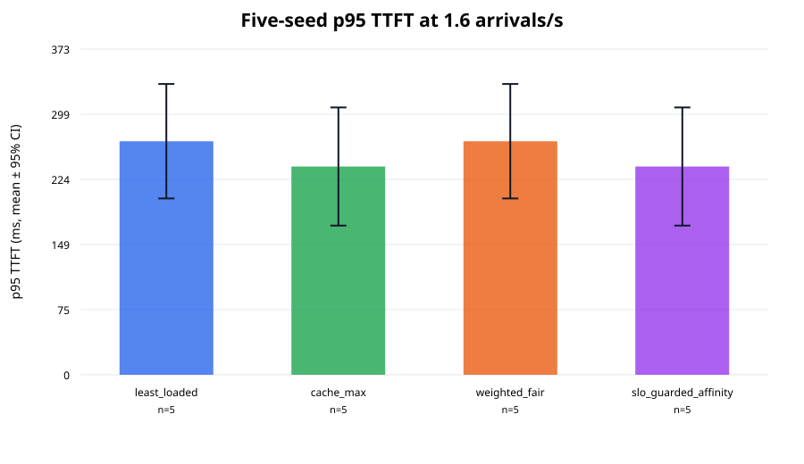
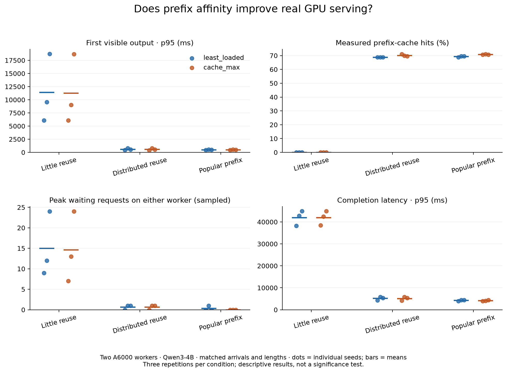

# LLMSchedBench

LLMSchedBench is a trace-driven benchmark for comparing how LLM requests are
routed across shared inference workers. It combines chat, coding-agent, and
API/batch traffic, replays workloads in
[LLMServingSim](https://github.com/casys-kaist/LLMServingSim) or against real vLLM
GPU workers, and compares routing behavior. The simulator reports latency, cache
reuse, fairness, goodput, starvation, and utilization; the hardware backend records
streamed request timing and server telemetry for two routing policies.

Use it to answer questions such as:

- Does cache-aware routing improve time to first token without hurting
  fairness?
- How does a policy behave as offered load increases?
- Do observed differences persist across deterministic workload seeds?
- Which requests or tenants benefit—and which are left waiting?

The benchmark currently includes four policies:

| Policy | Routing strategy |
|---|---|
| `least_loaded` | Sends each request to the worker with the least queued work. |
| `cache_max` | Maximizes reusable prefix tokens, then uses load as a tie-breaker. |
| `weighted_fair` | Orders requests by tenant-weighted service and routes to the least-loaded worker. |
| `slo_guarded_affinity` | Prefers a warm-cache worker when its predicted TTFT meets the SLO; otherwise selects the fastest predicted worker. |

## How it works

1. Fetch and normalize checksummed Qwen-Bailian and TraceLab traces.
2. Build a deterministic mixed workload from a YAML or JSON scenario.
3. Calibrate simulated prefill and decode service rates.
4. Replay the same workload through each routing policy, one run at a time.
5. Store immutable run inputs, decisions, outputs, logs, and checksums.
6. Produce per-run metrics, cross-seed confidence intervals, SVG figures, and
   a Markdown report.

The policy engine is written in C++20 and exposed to Python with pybind11.
Python handles data preparation, experiment orchestration, validation, and
reporting. The simulator runs in a pinned Linux AMD64 Docker image.

## Published simulator results

The included experiment contains 28 runs over a controlled 60% chat, 25%
coding-agent, and 15% API/batch workload on two simulated RTX PRO 6000 workers
serving Llama 3.1 8B.

At 1.6 top-level arrivals per second, each policy was evaluated across five
deterministic seeds. Values below are means with two-sided 95% Student-t
confidence intervals.

| Policy | p95 TTFT (ms) | Prefix hit rate | SLO goodput (calls/s) |
|---|---:|---:|---:|
| `least_loaded` | 267.57 [201.97, 333.16] | 44.45% [35.39%, 53.52%] | 1.76 [1.33, 2.19] |
| `cache_max` | 238.65 [170.98, 306.33] | 52.80% [40.48%, 65.11%] | 1.84 [1.35, 2.33] |
| `weighted_fair` | 267.57 [201.97, 333.16] | 44.45% [35.39%, 53.52%] | 1.76 [1.33, 2.19] |
| `slo_guarded_affinity` | 238.65 [170.98, 306.33] | 52.80% [40.48%, 65.11%] | 1.84 [1.35, 2.33] |



The cache-oriented policies have better means in this workload, but the
intervals overlap substantially. These results therefore do not establish a
decisive policy ranking. The controlled workload also produced limited
separation between each policy pair, motivating broader cache-reuse, affinity,
and fairness ablations.

See the [full report](artifacts/overnight-m3/report.md) for the three-load
single-seed matrix, metric definitions, and limitations. Machine-readable
results are available as [per-run summaries](artifacts/overnight-m3/run-summaries.jsonl),
[aggregate confidence intervals](artifacts/overnight-m3/aggregate.json), and a
[checksummed artifact manifest](artifacts/overnight-m3/manifest.json).

## Quick start

### Requirements

- Python 3.11
- CMake 3.24 or newer and a C++20 compiler
- Docker with Linux AMD64 image support

```bash
git clone --recurse-submodules https://github.com/larkindaniel/LLMSchedBench.git
cd LLMSchedBench

python3.11 -m venv .venv
source .venv/bin/activate
python -m pip install --upgrade pip
python -m pip install -e '.[dev]'

./scripts/reproduce-headline.sh --preflight-only
```

The preflight validates the scenario, Python suite, lint, native build, and C++
tests without running the simulator.

### Reproduce the published benchmark

```bash
source .venv/bin/activate
./scripts/reproduce-headline.sh
```

This command prepares the data and simulator, calibrates the benchmark cluster,
runs the 28 experiments serially, and regenerates a completion-validated
report. It is resumable: completed runs are checksum-validated and skipped.
Expect several hours on Apple Silicon because the simulator uses Linux AMD64
emulation.

### Run one policy

After the data, image, and calibration outputs have been prepared by the
reproduction workflow:

```bash
llmschedbench run scenarios/balanced.yaml \
  --policy cache_max \
  --arrival-rate-rps 1.6 \
  --seed 1729 \
  --run-root runs/manual
```

Each successful run creates an immutable directory containing the resolved
scenario, generated workload, request map, routing decisions, simulator output,
metrics inputs, logs, and SHA-256 checksums.

### Define a workload

Copy [scenarios/balanced.yaml](scenarios/balanced.yaml) and adjust its cluster,
tenant weights and TTFT SLOs, traffic mix, arrival rate, seed, or coding-session
shape. Validate the result before running it:

```bash
llmschedbench scenario compile scenarios/my-scenario.yaml
```

The canonical field definitions and normalization rules are documented in the
[data schema](docs/DATA_SCHEMA.md).

### Generate a report

```bash
llmschedbench report runs/overnight-m3 \
  --output artifacts/overnight-m3 \
  --require-complete
```

The report command validates completed run manifests and produces JSONL
summaries, cross-seed intervals, static SVG figures, a Markdown report, and an
artifact manifest.

## Real-GPU backend

An initial vLLM backend replays the same mixed workloads through `least_loaded`
and `cache_max` on independent GPU workers. It includes a rental-host launcher,
streamed request measurements, checksummed artifacts, and hardware comparison
reports. On September 5, 2026, Qwen3-4B passed a 47-call single-A6000 validation
and a two-A6000 comparison with 47 successful calls per policy. These are smoke
tests, not evidence of a general policy winner.
See [the rented-GPU guide](docs/REAL_GPU.md) for setup and measurement limitations.

A subsequent controlled prefix-affinity study completed **18 runs and 3,456
successful requests** on two A6000 workers. Shared-prefix conditions had much
lower latency and fewer waiting requests under both policies; Cache-Max added
modest improvements, but the popular-prefix bottleneck hypothesis was not observed
at this operating point. These are three-seed descriptive results, not a universal
policy ranking. See the [hardware findings and figure](docs/GPU_AFFINITY_FINDINGS.md),
[experiment protocol](docs/GPU_AFFINITY_STUDY.md), and
[interview walkthrough](docs/GPU_AFFINITY_INTERVIEW.md).

The hardware study used Qwen3-4B, 4096-token inputs, 128-token outputs, and three
workload seeds at a nominal 4 requests/second. The table reports **means of three
per-run p95 first-output latencies**, not pooled percentiles or confidence intervals.
Server cache-hit percentages count cached input tokens.

| Prefix pattern | `least_loaded` p95 first output | `cache_max` p95 first output | Server cache hits (LL / CM) | Peak sampled waiting requests (LL / CM) |
|---|---:|---:|---:|---:|
| Little reuse | 11,443 ms | 11,276 ms | 0% / 0% | 24 / 24 |
| Distributed reuse | 598 ms | 572 ms | 68.75% / 70.18% | 1 / 1 |
| Popular prefix | 514 ms | 492 ms | 69.27% / 70.83% | 1 / 0 |



Prefix sharing reduced first-output latency by roughly 95% relative to the
unique-prefix control under **both** policies at this operating point. This is
not a 95% improvement from Cache-Max. Its additional benefits were much smaller,
and three seeds do not establish a general policy ranking. The expected
popular-prefix bottleneck did not occur; requests remained almost evenly split
between workers.

The study also completed 192 probe requests and 80 warm-up requests, bringing its
total to **3,728 successful requests**. Both rental attempts were confirmed
terminated. A conservative launch-to-confirmed-termination compute estimate is
**US$3.92**, including the failed setup attempt, before tax or currency conversion;
this is not an invoice. See the [rental record](artifacts/gpu-affinity/rental-outcome.json).

The [full run table](artifacts/gpu-affinity/report.md),
[per-run measurements](artifacts/gpu-affinity/results.json),
[paired differences](artifacts/gpu-affinity/aggregate.json), and
[checksummed evidence manifest](artifacts/gpu-affinity/manifest.json) are included
with the source snapshot and compressed request logs.


## Metrics

- **TTFT and completion latency:** p50, p95, p99, and mean, globally and by
  tenant.
- **SLO attainment and goodput:** calls meeting the tenant TTFT target within
  the fixed measurement window.
- **Cache reuse:** avoided prompt tokens, cross-checked between routing
  decisions and simulator output.
- **Fairness:** Jain's index over tenant token service normalized by configured
  weights.
- **Starvation:** calls released but unfinished at the measurement horizon,
  plus a separate severe TTFT-SLO measure.
- **Load:** active NPU utilization and worker request/token imbalance.
- **Agent workflows:** end-to-end completion latency for dependent coding-agent
  call sequences.

## Scope and limitations

The simulator results use Linux AMD64 emulation on Apple Silicon and controlled
service-rate assumptions. The separate hardware study uses real A6000 GPUs and
Qwen3-4B; it must not be compared directly with the Llama simulation as if only the
backend changed.

The hardware study covers one selected load, two workers, three seeds, and short
synthetic fixed-length workloads. First-output timing includes client scheduling
lag. Queue telemetry is sampled approximately once per second. These controls
isolate prefix-sharing behavior, but do not establish production performance,
weighted fairness, real agent-chain behavior, or a universal policy ranking.
Longer heterogeneous workloads, load sweeps, and a matched simulator/hardware
comparison remain future work.

Raw public data and generated runs are excluded from Git because they are bulky
and reproducible from checksummed inputs. See the
[roadmap](docs/ROADMAP.md) and [simulator regression record](docs/REGRESSIONS.md)
for planned work and compatibility details.
